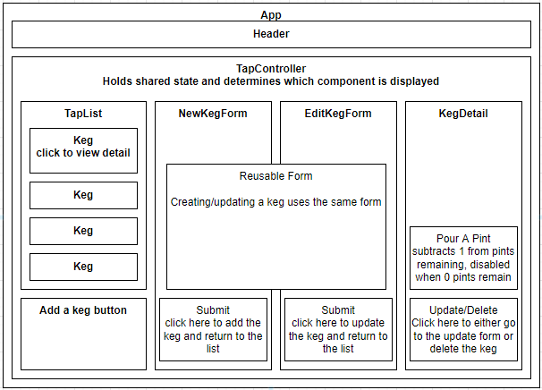

# _TAP THAT Taproom_

#### By _**Matt C.**_

#### _Example of how a taproom might work if it was made on React._

## Technologies Used

* _HTML_
* _CSS_
* _JavaScript / JSX_
* _Bootstrap_
* _React_
* _NPM_

## Component Diagram

## Description

_First code review project for React. Kegs have full CRUD functionality, and you can pull pints from them until the kegs are empty. The pictures slowly change as the kegs have fewer pints remaining within._

## Setup/Installation Requirements

* _Run `git clone https://github.com/catperso/tap-room-react` from the terminal to clone the project directory to your device._
* _cd into the tap-room-react directory then run `npm install` from the terminal to set up the environment and install all the npm packages._
* _Run `npm run start` from the terminal to build the project and start a live development server._
* _Navigate to `localhost:3000` in your favorite web browser to enjoy the project._

## Known Bugs

* _Editing and pulling pints from kegs moves them to the bottom of the list of all kegs._

## License - [MIT](https://opensource.org/licenses/MIT)

_If you run into any problems/bugs feel free to send me an email [(mc.casperson@gmail.com)](mailto:mc.casperson@gmail.com) with details._

Copyright (c) _2022_ _Matt C._